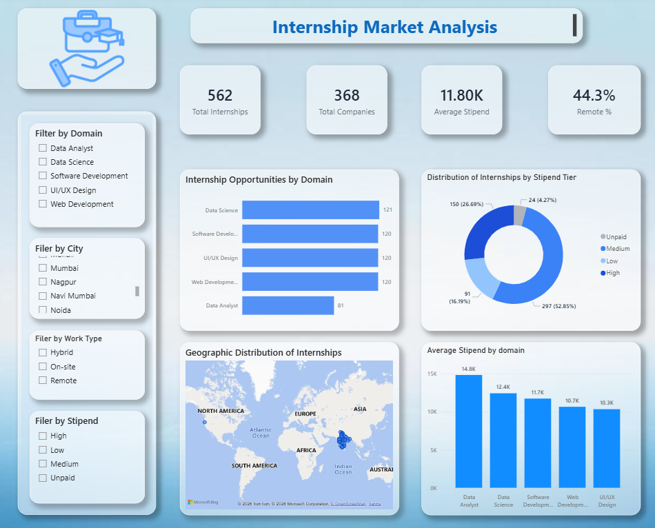
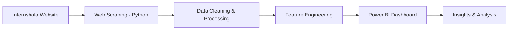

# 💙 Internship Market Analysis (Internshala)

### 📊 End-to-End Data Analytics Project

<p align="center">
  
  
  
</p>

---

## 🎯 Project Summary

As a student actively searching for internships, I wanted to understand:

* Which domains offer the most opportunities?
* Are internships actually well-paid?
* Is remote work increasing?

To answer these questions, I built an end-to-end data analytics project by scraping internship data and transforming it into actionable insights.

This project demonstrates my ability to:

* Perform **web scraping using Python**
* Clean and preprocess real-world messy data
* Engineer features for analysis
* Build **interactive Power BI dashboards**
* Communicate insights effectively

---

## 🎨 Dashboard Preview

<p align="center">
  
</p>

---

## 🚀 Key Metrics

| Metric                     | Value  |
|--------------------------|--------|
| 📊 Total Internships      | 1000+  |
| 💻 Top Domain             | Data Science |
| 💰 Avg Stipend Range      | ₹5K – ₹15K |
| 🌍 Remote Opportunities   | Growing |
| 📍 Top Locations          | Major Cities |

---

## 📊 Insights Snapshot

* 📈 Data Science roles have the highest number of opportunities  
* 💰 Data Analyst roles offer comparatively better stipends  
* 🌍 Remote internships are increasing but still limited  
* 📍 Most jobs are concentrated in a few key cities  
* 🏢 Certain companies dominate hiring trends  

---

## 🔄 Workflow



---

## 🛠️ Tech Stack
<p align="center">   </p>

---

## 📂 Repository Structure

```bash
│
├── notebooks/
│   ├── web_scraping.ipynb
│   └── data_cleaning.ipynb
│
├── dashboard/
│   └── dashboard_analysis.pbix
│
├── images/
│   └── dashboard.png
│
└── README.md
```

---

## ⚙️ Setup Instructions

### 1️⃣ Clone Repository

```bash
git clone https://github.com/samikshapawar08/Internship-Market-Analysis.git
```

### 2️⃣ Run Scraper

* Open Jupyter Notebook
* Run scraping notebook

### 3️⃣ Clean Data

* Execute cleaning notebook
* Generate cleaned dataset

### 4️⃣ Clean data

* Open .pbix in Power BI
* Load cleaned dataset
* Explore visuals

---

## 📚 Key Learnings

✔️ Web scraping real-world data

✔️ Data cleaning & preprocessing

✔️ Feature engineering

✔️ Dashboard storytelling

✔️ End-to-end project execution

---

## 🔮 Future Improvements

## 🔮 Future Improvements

*  Extract job descriptions for deeper analysis
  
*  Perform skill-based demand analysis
  
*  Build automated data pipeline
    
*  Add real-time data updates

---

## 🤝 Connect With Me

<p align="center">
  <a href="www.linkedin.com/in/samiksha-pawar-aa1018266"></a>
  <a href="#"></a>
</p>

---

## ⭐ Support

If you like this project, consider giving it a ⭐ on GitHub!

---

<p align="center">
  <b>“Turning Data into Decisions 📊”</b>
</p>

